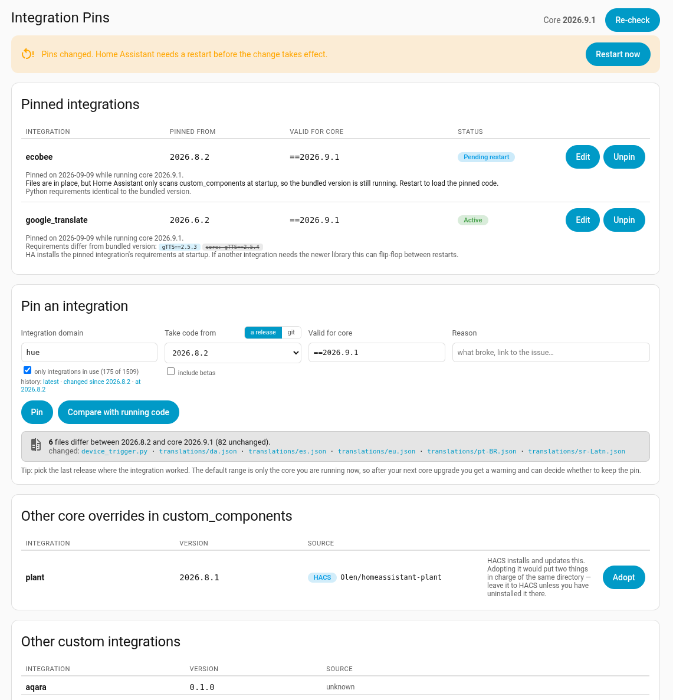

# Integration Pins for Home Assistant

Run one core integration's code from a different Home Assistant release, without downgrading the rest.

When a release breaks an integration the usual choices are to live with it or roll back the whole install. This adds a third: pick the integration and the release you want its code from, and everything else keeps running the current core.

Nothing changes automatically on upgrade. Each pin carries a "valid for core" range; when the running core leaves that range you get a Repair warning, and the pinned code keeps running until you decide what to do.



## Install

1. Copy `custom_components/integration_pins/` into your config directory.
2. Restart Home Assistant.
3. Settings → Devices & services → Add integration → **Integration Pins**.

The panel appears in the sidebar for admin users. It needs outbound HTTPS to `pypi.org` and `files.pythonhosted.org`, plus `api.github.com` and `raw.githubusercontent.com` if you pin from git.

## Using it

**Pin** an integration to a release, then restart to load it.

**Take the code from git** instead to pick up a fix that has merged but not shipped — enter a branch, tag or commit. Two caveats, which the panel also states: the repository carries English translations only, and `dev` is written against the *next* core release, so it can call helpers your core does not have yet.

**Compare with running code** says which files differ from what you are running, or that a release is identical to it and pinning would change nothing. The domain field links the integration's upstream history, where **changed since &lt;release&gt;** is the commits between that release and now; each changed file links to the commits that touched it.

When other integrations are built on the one you picked, the form says how many depend on it and which of those are loaded here.

**Valid for core** is a version range: `==2026.9.1` (the default — only the core you are on now), `~=2026.9.0` for any 2026.9.x, `>=2026.9.0,<2026.11.0` for a window, empty for any. Outside its range a pin shows **Out of range** and raises a Repair warning; widen the range if you have checked the pinned code still works, or unpin. A new pin shows **Pending restart** until Home Assistant has loaded it.

**Edit** changes the range or reason. **Unpin** removes the override; restart to go back to the bundled integration. **Re-pin** appears if the override goes missing or is replaced.

Unpinning deletes a pin taken from PyPI or git, since re-pinning fetches it again. An **adopted** copy exists nowhere else, so it is kept in `integration_pins_retired/` and listed at the bottom of the panel with a Delete button.

The panel also lists everything else in `custom_components/` and where it came from. Several HACS integrations replace a core one — `plant` is the usual example — and those should be left to HACS; adopting one would put two things in charge of the same directory. **Adopt** is for a copy you placed by hand, so it gets the same range checking.

Each pin shows how its Python requirements differ from the bundled version's. If another integration needs a different version of the same library, the two can fight over it across restarts.

## What can go wrong

Pinned code runs against a newer core than it was written for. Over one or two releases that is almost always fine, but it is not guaranteed — watch the log for deprecation warnings from `custom_components.<domain>`.

Pins on integrations that others import from, such as `bluetooth`, `mqtt`, `zha`, `recorder` and `http`, are far riskier than pins on ordinary device integrations. The panel warns you but will not stop you.

Home Assistant logs a "custom integration ... has not been tested" warning for every override at startup. That is expected.

## Development

```
uv venv --python 3.13 .venv && . .venv/bin/activate
uv pip install homeassistant pytest-homeassistant-custom-component "home-assistant-frontend==<version from homeassistant/components/frontend/manifest.json>"
pytest
```

```
custom_components/integration_pins/
  __init__.py       entry setup, panel registration
  manager.py        orchestrates pins, evaluates ranges, syncs Repair issues
  pinner.py         PyPI and GitHub lookup, download/verify, comparison, extract/retire
  store.py          .storage/integration_pins persistence
  websocket.py      integration_pins/* commands used by the panel
  config_flow.py    single-instance config entry
  panel/            the sidebar panel (plain web component, no build step)
```

Editing the panel needs only a browser reload; Python needs a restart, which can leave the panel newer than its backend. The backend advertises what it understands in `const.FEATURES` and the panel hides anything the running one does not list — add a name there whenever the panel starts depending on something the previous version could not do.

Tests drive the pin → pending → out-of-range → unpin flow through the websocket API against a real Home Assistant core, with PyPI and GitHub served from an aiohttp mock.
